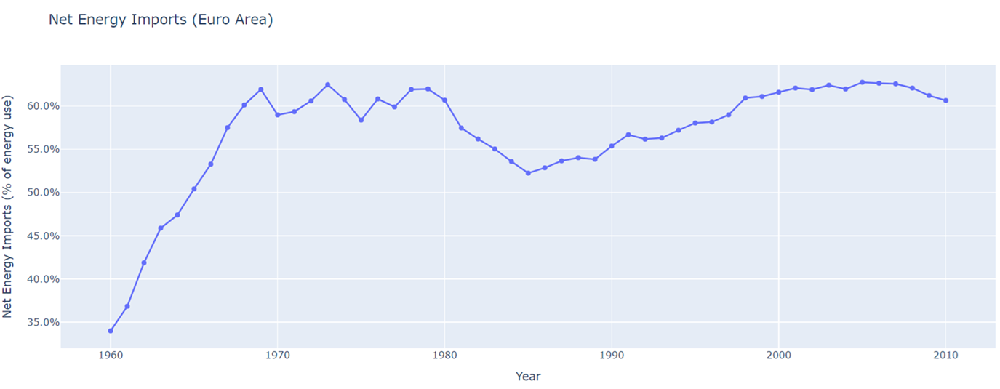

# Green Energy Transformation in the Euro Area (1970 - 2010)

## Investigation Theme
**Objective**: To explore how countries in the Euro Area successfully reduced their dependency on fossil fuels and transitioned to sustainable energy.

## Tech Stack
**Python:** Applied to analyze data ad find patterns in it.

**Pandas:** Utilized for Exploratory Data Analysis in the Google Colab.

**Matplotlib:** Employed for creating visualizations in the Python notebook.

**Plotly:** Leveraged to transform analysis into an interactive and visually compelling story.

## Key Analysis
### CO2 Emissions vs. Population in the Euro Area
- **Initial Observation**: There was a clear positive linear relationship between population growth and CO2 emissions. As the population increased, CO2 emissions also rose significantly.
- **Breakthrough**: Euro Area countries managed to disrupt this trend, reducing CO2 emissions and achieving greater sustainability. By around 2009, they accomplished a major milestone, with the CO2 emission curve falling below the population growth curve.
- **Implication**: Despite continued population growth, this shift indicates a successful transition toward more sustainable energy practices.

## Further Investigation
- **Understanding the Trend**: Analyze the reasons behind the initial link between population growth and CO2 emissions.
- **Sustainability Measures**: Examine the specific policies and steps Euro Area countries took to reduce their emissions and foster sustainability.

### CO2 Emission vs Population Trend (Euro Area)

## Investigate why population increase, increased CO2 emission
### Key Insights
- **Population Growth and CO2 Emissions**: Production of electricity from energy sources can be a major cause of an increase in CO2 emission.

### Observation
From the Graph of Electric Power Consumption and Urban Population in Euro Area Countries, we can observe that:
1. With the increase in population, the urban population also increased.
2. The increase in urbanization increased energy consumption as electricity demand increased.
3. To keep up with the demand more electricity was produced from energy sources.
4. This led to an increase in CO2 emission as a primary source of energy was fossil fuels.

   
### Electric Power Consumption vs Urban Population Trend (Euro Area)

## Dependency on Fossil Fuels
### Electricity Production and Energy Sources
1. From the plot, it is evident that **fossil fuels** were the primary source of electricity production.
2. Though countries were using **hydroelectric power** for electricity generation, it had its own set of limitations.
3. One major concern was the **environmental impact**. A hydroelectric power plant had several environmental impacts on the river ecosystem and the surrounding biodiversity.
4. As electricity demand increased, it became evident that there was a need to focus on other **renewable energy sources**. Relying solely on hydroelectric power was not sufficient to meet the growing energy needs.

## Graph of Electricity Production: Fossil Fuels vs Renewables in EMU Countries

## Diversifying Energy sources
1. From the plot of "Renewable Electricity Production in EMU Countries (Excluding Hydroelectric)" it is seen that the adaption of alternate renewable sources of energy other than hydroelectric increased from 2000 onwards.

2. This signifies those countries in the Euro Area started focusing on alternate renewable energy sources other than hydroelectric to reduce their dependency on fossil fuels.

### Graph of Renewable Production (Excluding Hydroelectric)

## Increase in energy imports
- To further accelerate the reduction of their dependency on fossil fuels, EMU countries have also increased imports of sustainable energy sources, such as natural gas, from other nations.
- The line plot illustrates this trend.

### Net Energy Imports (Euro Area)

## Reduced dependency on fossil fuels
- The stacked bar graph below shows that, through a combination of energy imports and diversification of renewable energy resources, EMU countries significantly reduced their dependency on fossil fuels.
- This shift eventually led to a decrease in CO2 emissions, explaining why the CO2 emissions curve fell below the population growth curve around 2009.

### Energy Production: Fossil Fuels vs (Renewables + Energy Imports) in Euro Area

## Result:
This shift eventually led to a decrease in CO2 emissions, explaining why the CO2 emissions curve fell below the population growth curve around 2009.
